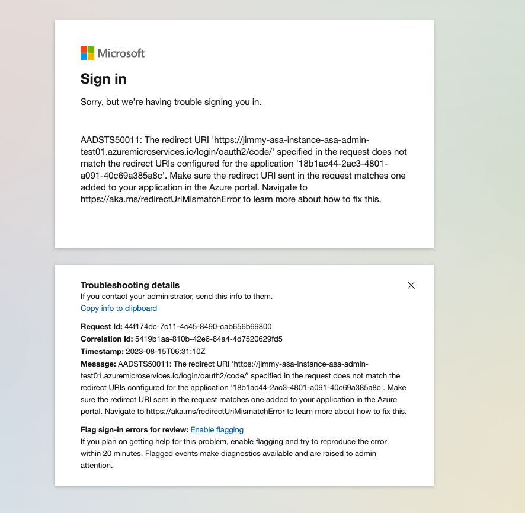

# Introduction - Azure Spring Apps Admin

Spring Boot Admin Server is an application for managing and monitoring microservice applications.

This repository maintains a customized Spring Boot Admin Server - **Azure Spring Apps Admin**, which did some enhancements beyond community Spring Boot Admin.

# What's the benefit of Azure Spring Apps Admin

1. Integrated with Azure Active Directory to secure your dashboard
2. Easily deploy with one click Azure Spring Apps button instead of multiple Azure commands
3. Fully compatible with community Spring Boot Admin

# Run Azure Spring Apps Admin on Azure Spring Apps

To deploy Spring Boot Admin to Azure Spring Apps using the Azure Spring Apps button, you need below prerequisites:

- An Azure subscription
- An Azure AD administrative roles user
- Azure Service Principal client id to enable Azure Active Directory - Adding AAD_CLIENT_ID environment variable
- Azure Service Principal client secret to enable Azure Active Directory - Adding AAD_CLIENT_SECRET environment variable
- Azure Service Principal tenant id to enable Azure Active Directory - Adding AAD_TENANT_ID environment variable

Then, you can run this Azure Spring Apps Admin by one click button:

After finish deployment, you will redirect the application endpoint, then to do oauth2 login.

If you meet below error, please refer [Add a redirect URI](https://learn.microsoft.com/en-us/azure/active-directory/develop/quickstart-register-app#add-a-redirect-uri) to add a redirect url:

After everything deploy successful, managing and monitoring your apps via Azure Spring Apps Admin.

